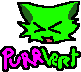



    

> [!note]
> **BASIC** projects are simple little games (✿◠‿◠), created to test the *limits* of the
> [Ratelite](https://github.com/MrSinaf/Ratelite) engine.
>
> They are used to explore the engine's features, verify what works, and identify
> bugs or potential improvements. These projects (especially during development (。_。)),
> use a **local and/or unstable** version of the engine.
> 
> Yeah... We penetrate him without protection OwO...

    

